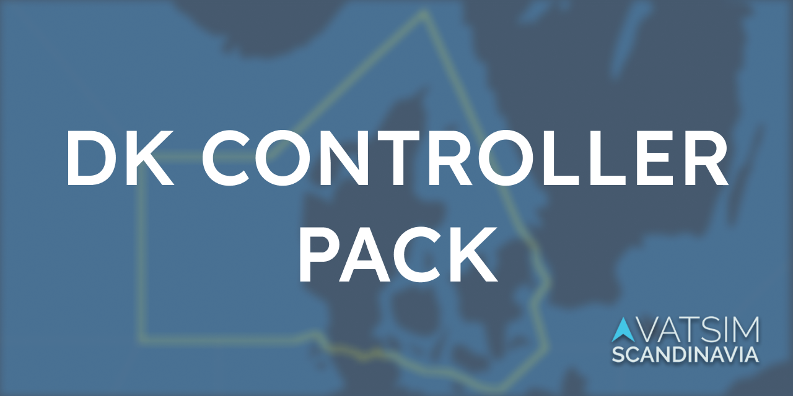
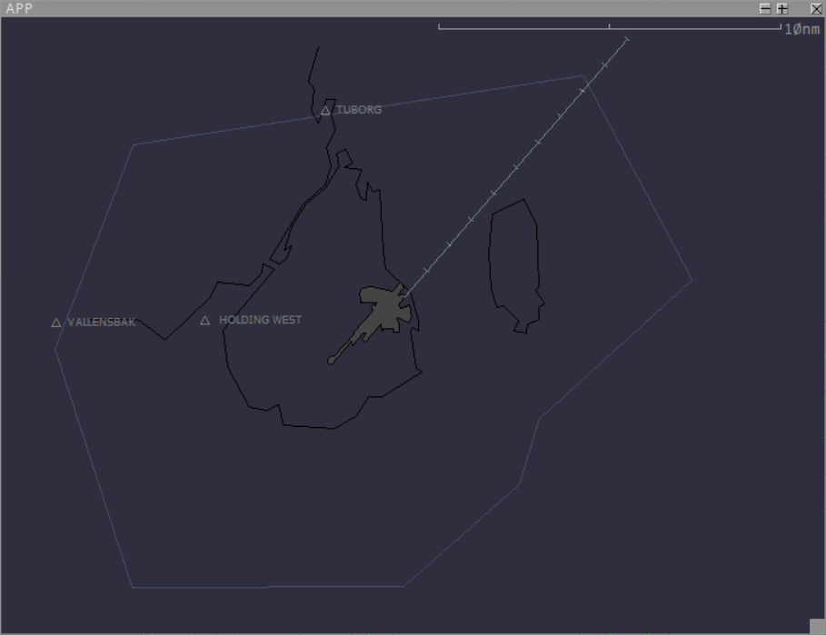
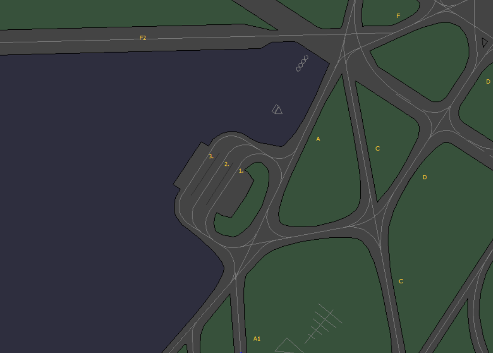
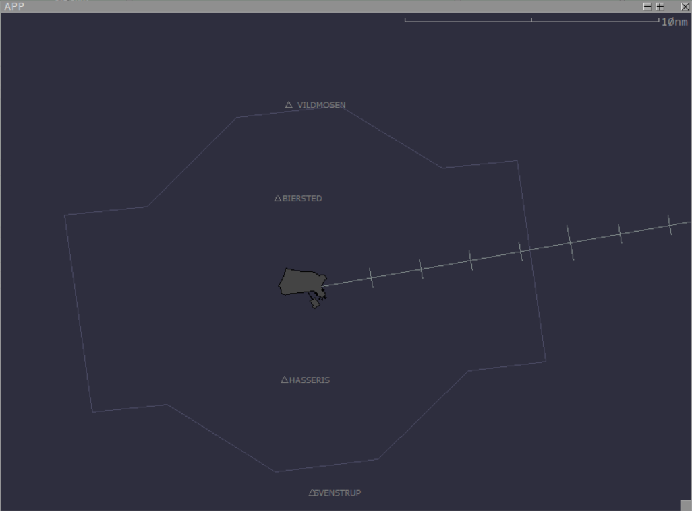
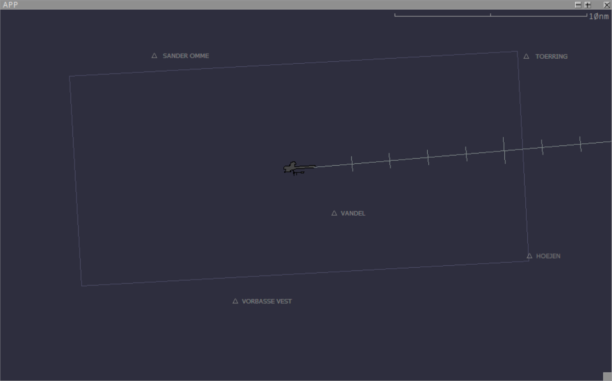



# EKDK FIR Controller Pack
The DK controller pack provides the tools to VATSIM Scandinavia controllers to control relistically, efficiently and easily on the VATSIM network.

This pack DOSE NOT include sectorfiles and normal plugins, its automaticly downloaded within Euroscope.
## What is included:
### App view
* VFR Reporting points
* Extended centerline w/ 2ms
* Controll Zone border
* EKCH A Deiceing Lanes

### Included In The Pack:
EuroSounds - [ganderoceanic.ca](https://ganderoceanic.ca/eurosounds)
DiscordEuroscope - [DiscordEuroscope ](https://github.com/Kirollos/DiscordEuroscope)
